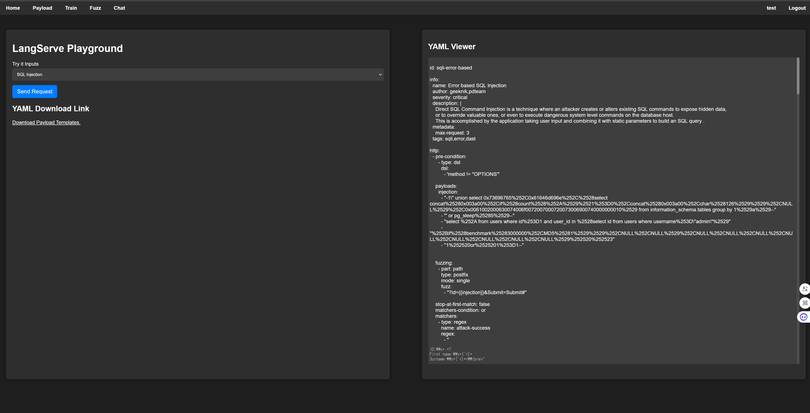
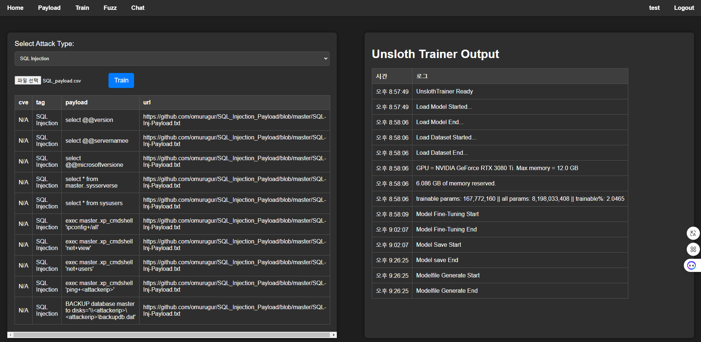

# LlamaFuzzer
Llama3 8B 모델을 활용한 AI Fuzzer입니다.

현재 SQL Injection, XSS, Command Injection(RCE), File Inclusion 공격을 Llama3가 Payload를 생성하여 Fuzzing에 사용 가능합니다.

공격 기법을 추가하고 싶으시면 데이터셋을 추가로 학습시켜서 추가하시면 됩니다.

FastAPI를 활용하여 웹에서 모델 학습, Fuzzing을 할 수 있도록 개발하였습니다.

아직은 LLM의 성능보다는 LLM이 Payload를 생성하고, 그걸 Fuzzing에 활용하는 것에 초첨을 맞추어 개발하였기 때문에 LLM의 성능은 그리 높지 않습니다.

추후에 LLM의 성능을 개선한 버전을 개발할 예정입니다.

## 테스트 환경
OS : Ubuntu 24.04.1 LTS (WSL 2)

GPU : GeForce RTX 3080 Ti 12GB

RAM : 32GB

Windows에서는 경로 문제로 동작되지 않을 수도 있습니다. Windows에서 실행하실 때는 코드에 정의되어 있는 경로를 잘 확인해주세요.

## 설치
LlamaFuzzer를 설치하기 전, poetry와 nuclei를 설치해야 합니다. [poetry 설치](https://python-poetry.org/docs/) [nuclei 설치](https://github.com/projectdiscovery/nuclei)
```bash
$ git clone https://github.com/suriryuk/LlamaFuzzer.git
$ cd LlamaFuzzer
$ poetry install
```

## 사용법
FastAPI 서버를 실행시키는 방법은 간단합니다. main.py를 실행하기만 하면 됩니다.
```bash
$ python main.py
```
### Payload
Payload 페이지는 단순히 LLM 모델이 생성한 Payload만 받아보고 싶을 때 사용하는 페이지입니다.

Attack Type을 선택하고, 요청을 보내면 LLM 모델이 생성한 Payload를 Nuclei Template의 형태로 반환합니다.

|<b>Payload Page</b>|
|:--:|
||

### Train
Train 페이지는 LLM 모델을 학습시킬 수 있는 페이지입니다.

학습 데이터셋을 업로드하고 Train 버튼을 누르면 서버에서 학습이 진행됩니다. 학습 데이터셋은 다음 표의 형식을 따릅니다.
||cve|tag|payload|url|
|---|---|---|---|---|
|값|payload의 cve 코드|payload의 공격 타입|공격에 사용되는 payload|payload를 수집한 출처|
|비고|cve 코드가 없다면 Null 값도 가능|공격 이름을 지정||출처의 링크 사입|

학습 진행 상황은 로그를 통해 확인할 수 있습니다.

|<b>Train Page</b>|
|:--:|
||

학습이 끝나면 `models` 디렉토리가 생성되고 그 안에 `{attack}_model` 이라는 디렉토리가 생성됩니다. ( ex. SQL_model )

해당 디렉토리의 이름으로 [ollama](https://ollama.com/)를 이용해 모델을 서빙합니다. SQL Injection 모델의 예시입니다.

```bash
$ cd models/SQL_model
$ ollama create SQL_model -f Modelfile
```

## Open source used
- [nuclei](https://github.com/projectdiscovery/nuclei): MIT License
- [unsloth](https://github.com/unsloth/unsloth): Apache 2.0 License